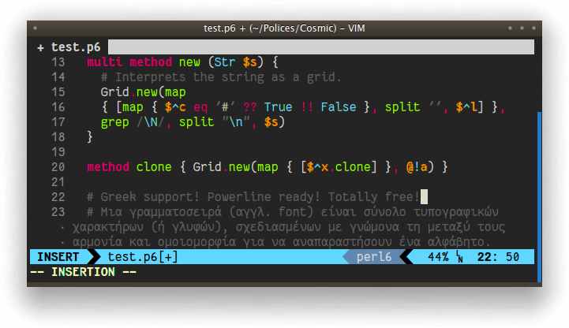
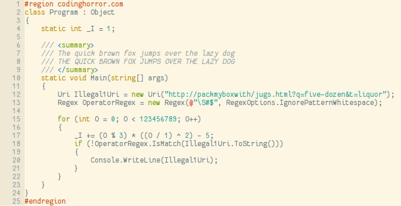
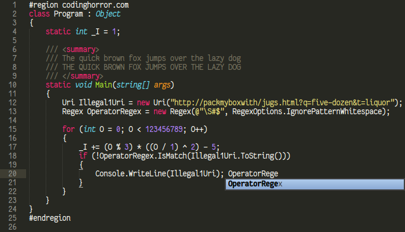
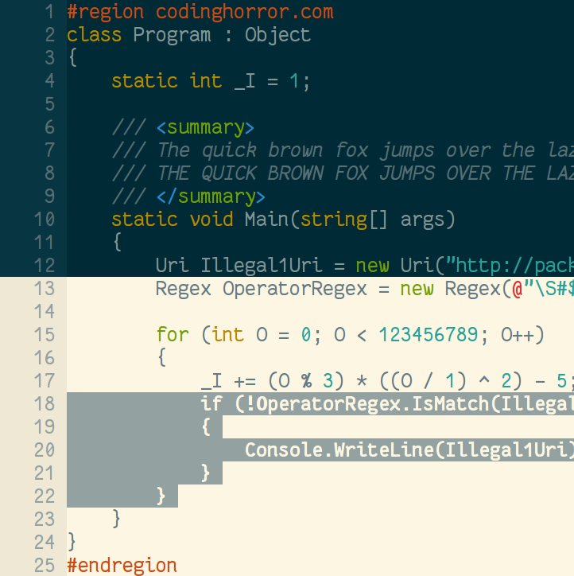

Cosmic Sans Neue Mono
=====================
                       
A programming font, designed with functionality in mind, and with some 
wibbly-wobbly handwriting-like fuzziness that makes it unassumingly cool.

Not related to other Cosmic Sans from the Internet. This one has Neue at the 
end, and it changes everything (most notably the coolness level). The name 
comes from my realization that at some point it looked like the mutant child of 
Comic Sans and Helvetica Neue. Hopefully it is not the case any more.

Inspirational sources include Inconsolata and Monaco. I have also been using 
Consolas a lot in my programming life, so it may have some points in common.

Weights, variants and glyph coverage
------------------------------------

The font includes a bold version, with the same metrics as the regular one. 
Both versions include the same ranges of characters : latin letters, some
accented glyphs (quite a lot), some greek letters, some arrows.

Please note that I have not tested all of the glyphs I have drawn (some letters
have those two layers of crazy accents that I have never witnessed before), so
it might look bad in some cases. Please report these problems: see next section.

It lacks a good italic version, which I plan to design later, in a fashion 
similar to Consolas' italic version, with new glyph designs, not just an added 
slant.

Author and license
------------------

Created by Jany Belluz \<jany.belluz AT hotmail.fr\>

Licensed under the SIL Open Font License (see [OFL.txt](OFL.txt)).

Please send me an e-mail or [report an issue on
Github](http://github.com/belluzj/cosmic-sans-neue/issues) if you stumble upon
bad design or rendering problems (with screen shot if possible), or if you need
more characters, or if you want to compliment me (I love compliments).

Versions
--------

1.1 - First release.

1.1.1 - Make slashes longer, ensure parenthesis and brackets are rendered at 
        the same height, and some other minor adjustments.
        
1.2 - Add the bold version.
      Various minor adjustments, new paragraph symbol, slanted dollar.
      
1.2.1 - Minor adjustments.

1.3 - Very slight change of metrics to add space between characters and lines.
      Various small changes : curlier curly brackets, more difference between
      various quotes, cleaner W, w, m, and rounder @. 
      Windows compatibility.
      More latin accents.
      Greek letters.
      Powerline characters.

1.3.1 - Various fixes: still cleaning m and w, reworked all ogoneks, changed a
        bit the dollar, moved some accents, eliminated glitches around
        Powerline symbols.
        TTF fonts are now hinted using Freetype's `ttfautohint`, which should
        give much better results on Windows (and maybe in Java apps and others
        contexts). In case this is a problem, please let me know and I will
        provide also an unhinted version.
        **Windows users should use the TTF (TrueType) files.**

